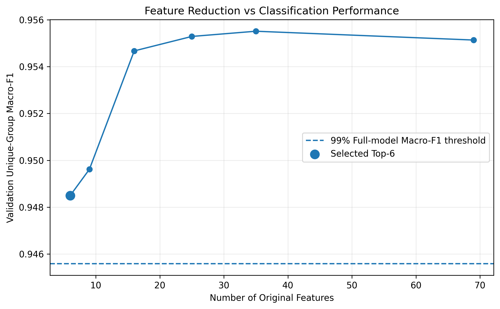
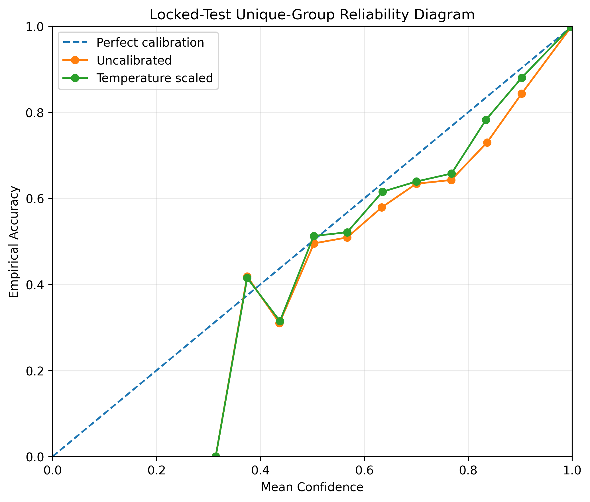
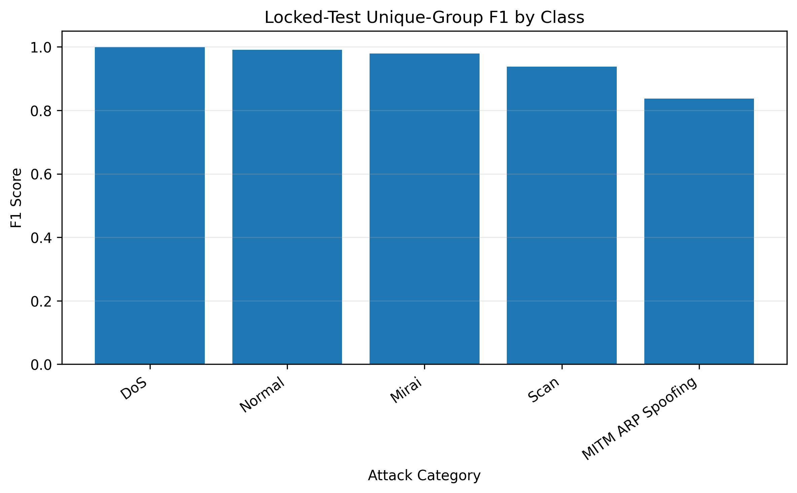
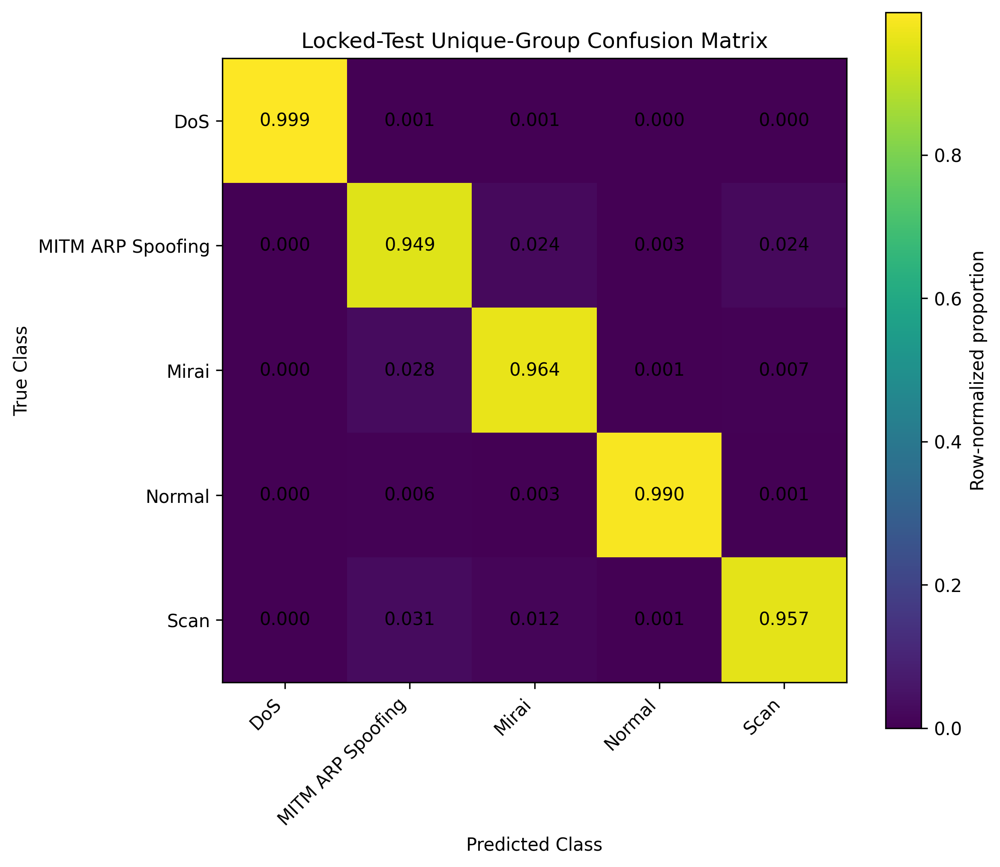

# Reliable and Efficient IoT Intrusion Detection

A leakage-aware machine-learning project for multiclass IoT network intrusion detection using compact flow features, duplicate-aware training, and probability calibration.

## Key Result

The final model is an **XGBoost classifier using only 6 original flow features**:

1. `Flow_Duration`
2. `Dst_Port`
3. `Src_Port`
4. `Protocol`
5. `Flow_Pkts/s`
6. `Init_Bwd_Win_Byts`

### Locked Unique-Group Test Performance

| Metric | Result |
|---|---:|
| Accuracy | 0.9733 |
| Balanced Accuracy | 0.9716 |
| Macro Precision | 0.9310 |
| Macro Recall | 0.9716 |
| Macro F1 | **0.9488** |
| Weighted F1 | 0.9744 |

The Top-6 model retained **99.30%** of the full 69-feature XGBoost model's validation Macro-F1.

---

## Research Question

Can IoT intrusion detection remain highly accurate and probabilistically reliable while using a substantially reduced network-flow feature representation?

---

## Dataset and Classes

The experiments use the **IoTID20 network intrusion dataset** in a five-class setting:

- DoS
- MITM ARP Spoofing
- Mirai
- Normal
- Scan

The raw dataset is not included in this repository.

---

## Leakage-Aware Experimental Design

The original dataset contained:

- **625,783 rows**
- **79 candidate predictors**
- **261,419 unique feature vectors**
- **164,087 exact duplicate rows**

A duplicate audit identified:

- **114 feature-identical groups with conflicting attack-category labels**
- **2,805 rows** involved in those ambiguous groups

These ambiguous groups were excluded before partitioning.

Identical feature vectors were kept entirely within one partition to prevent duplicate-driven information leakage.

### Frozen Partitions

| Partition | Rows | Unique Groups |
|---|---:|---:|
| Train | 374,506 | 156,782 |
| Validation | 125,170 | 52,262 |
| Test | 123,302 | 52,261 |

Feature-group overlap between Train, Validation, and Test was **zero**.

---

## Training Strategy

Sample weighting combined:

1. inverse feature-group frequency;
2. balanced class weights computed from unique training groups.

This reduced the influence of highly repeated feature patterns while balancing the effective contribution of the five classes.

---

## Baseline Model Comparison

Primary comparison used validation unique groups.

| Model | Accuracy | Balanced Accuracy | Macro F1 | Log Loss |
|---|---:|---:|---:|---:|
| Logistic Regression | 0.7452 | 0.7576 | 0.6647 | 0.5697 |
| Random Forest | 0.9553 | 0.9320 | 0.9153 | 0.1307 |
| XGBoost | **0.9774** | **0.9732** | **0.9551** | **0.0572** |

XGBoost was selected for feature-reduction experiments.

---

## Feature Reduction

Features were ranked using **XGBoost total gain**.

The selection rule was defined before the locked test set was opened:

> Select the smallest feature subset retaining at least 99% of the full-model validation unique-group Macro-F1.

| Feature Set | Macro F1 | Retention |
|---|---:|---:|
| Top-6 | 0.9485 | 99.30% |
| Top-9 | 0.9496 | 99.42% |
| Top-16 | 0.9547 | 99.95% |
| Top-25 | 0.9553 | 100.02% |
| Top-35 | 0.9555 | 100.04% |
| Full-69 | 0.9551 | 100.00% |

Therefore, the **Top-6 model** was selected.



---

## Probability Calibration

Temperature scaling was fitted using validation unique groups.

Final temperature:

`T = 1.099329`

### Locked-Test Calibration

| Metric | Before | After |
|---|---:|---:|
| Log Loss | 0.066754 | **0.066308** |
| Multiclass Brier Score | 0.037325 | **0.036973** |
| Equal-width ECE | 0.005717 | **0.005011** |
| Adaptive ECE | 0.005777 | **0.004458** |
| Confidence-Accuracy Gap | 0.005298 | **0.002718** |



---

## Final Locked-Test Performance

### Unique-Group Evaluation

| Class | Precision | Recall | F1 |
|---|---:|---:|---:|
| DoS | 0.9997 | 0.9987 | 0.9992 |
| MITM ARP Spoofing | 0.7494 | 0.9488 | 0.8374 |
| Mirai | 0.9952 | 0.9638 | 0.9792 |
| Normal | 0.9918 | 0.9900 | 0.9909 |
| Scan | 0.9191 | 0.9565 | 0.9375 |

MITM ARP Spoofing remains the most difficult class, primarily because of lower precision.





---

## Experimental Integrity

The locked test set was **not used** for:

- model selection
- feature ranking
- feature-subset selection
- weighting design
- probability-calibration fitting
- hyperparameter selection

The test set was evaluated only after the model, feature subset, weighting strategy, and calibration temperature had been frozen.

---

## Repository Structure

```text
reliable-iot-intrusion-detection/
├── README.md
├── requirements.txt
├── data/
│   ├── README.md
│   └── processed/
├── models/
│   ├── README.md
│   └── feature_selection/
├── results/
│   ├── figures/
│   └── tables/
└── .gitignore
```

<div dir="ltr" align="left">

Large raw datasets, prediction-level dumps, and trained model binaries are excluded from version control.

## Research Areas

- IoT Security
- Network Intrusion Detection
- Machine Learning for Cybersecurity
- Leakage-Aware Evaluation
- Feature-Efficient Detection
- Probability Calibration
- Reliable AI for Cybersecurity

## Author

**Maram M. Momani**

Cybersecurity Researcher  
Machine Learning for Cybersecurity | Network & IoT Security | Cyber-Physical Systems Security

</div>
